<html>
<head>
  <link rel="stylesheet" href="css/style.css">
  
</head>
<body>

</body>
</html>

  <h3>Home</h3>
  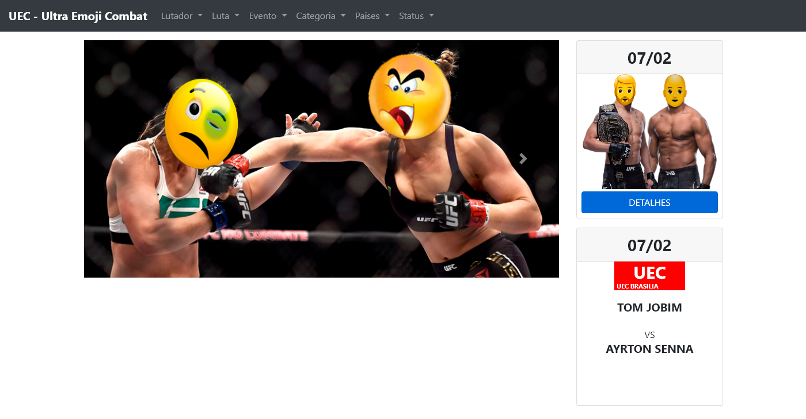

  <h3>Atletas</h3>
  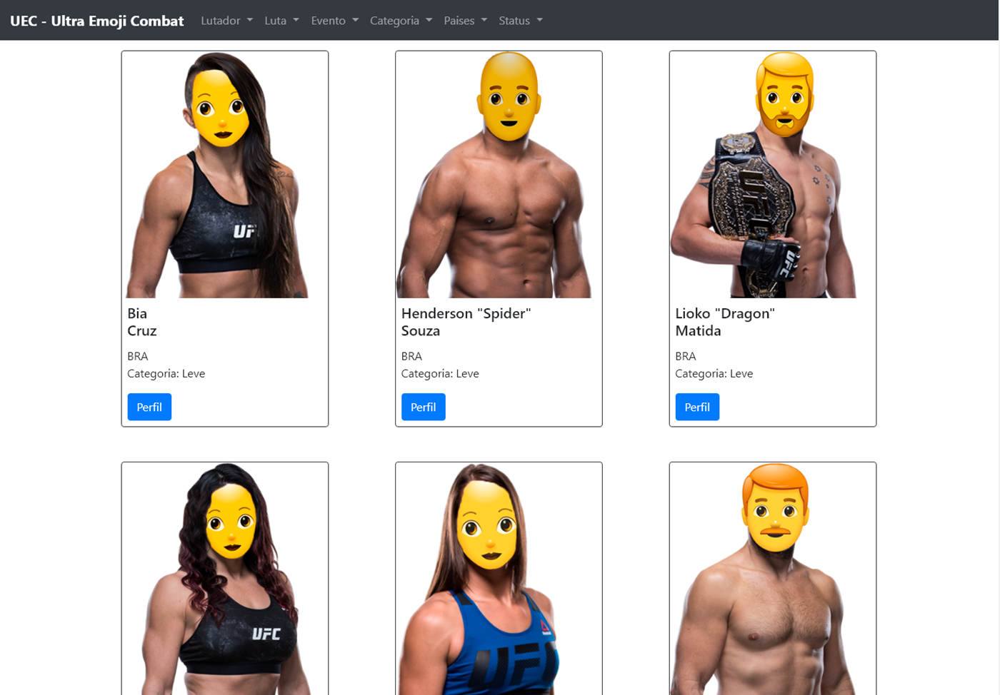
  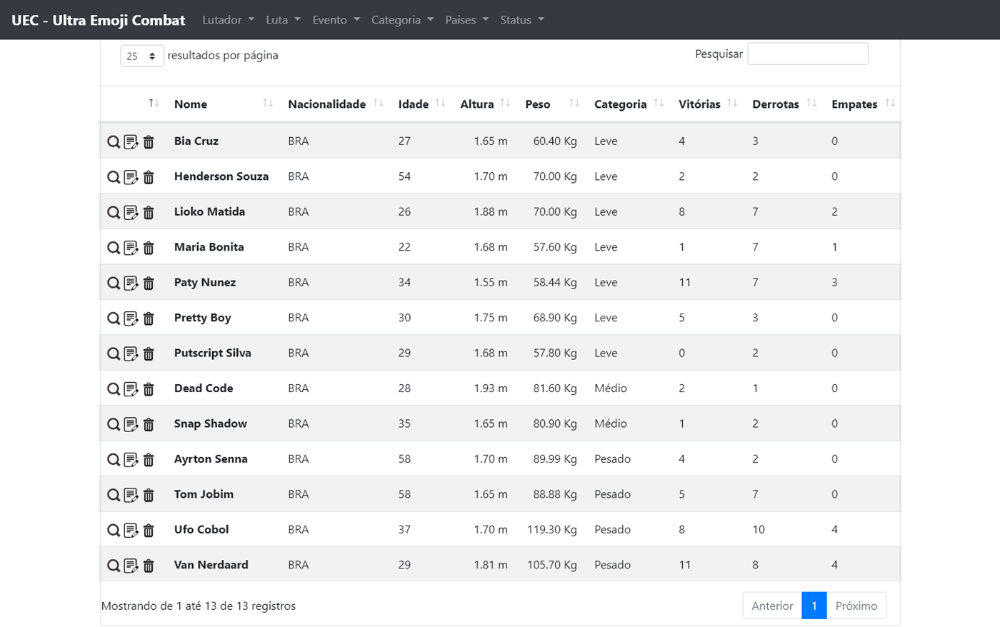
  
  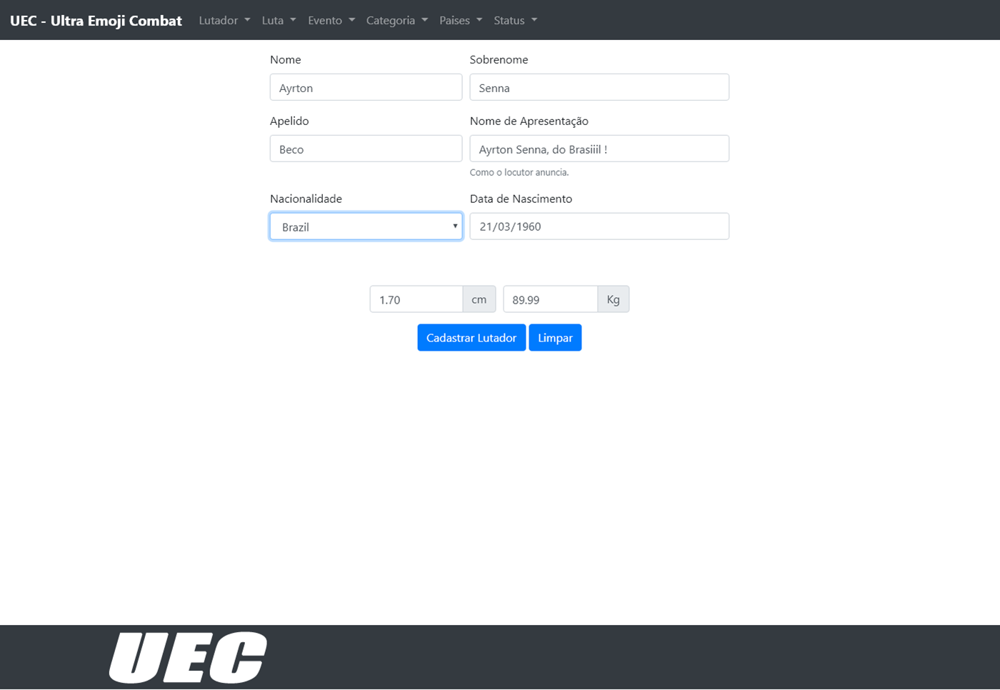

  <h3>Lutas</h3>
  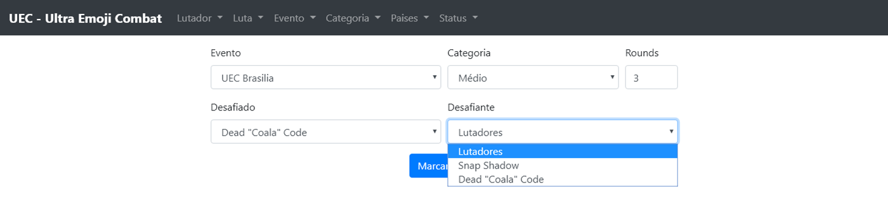
  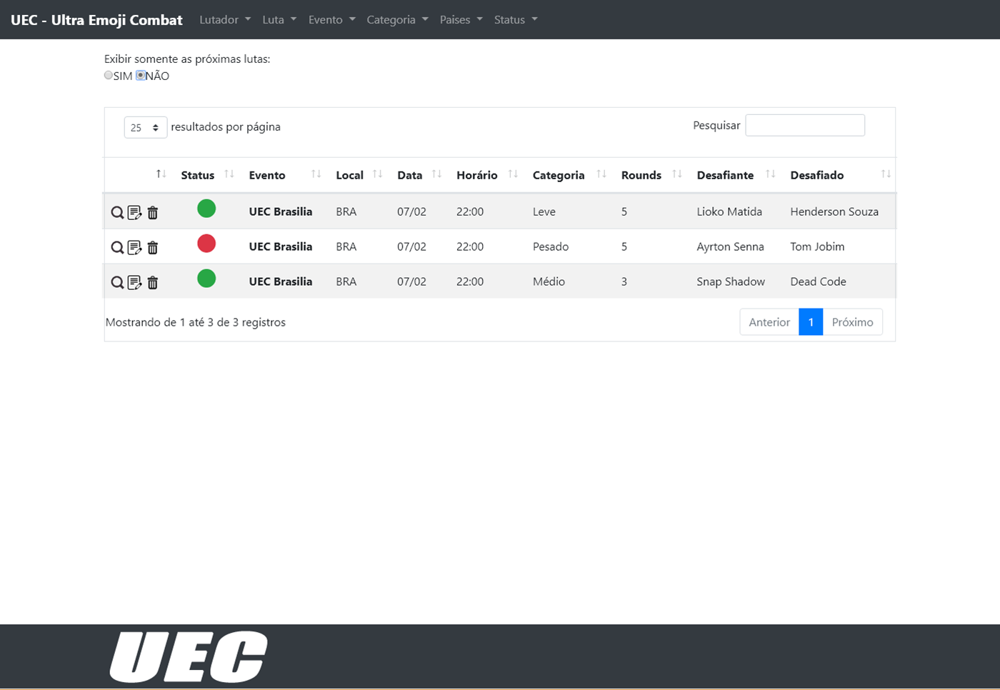
  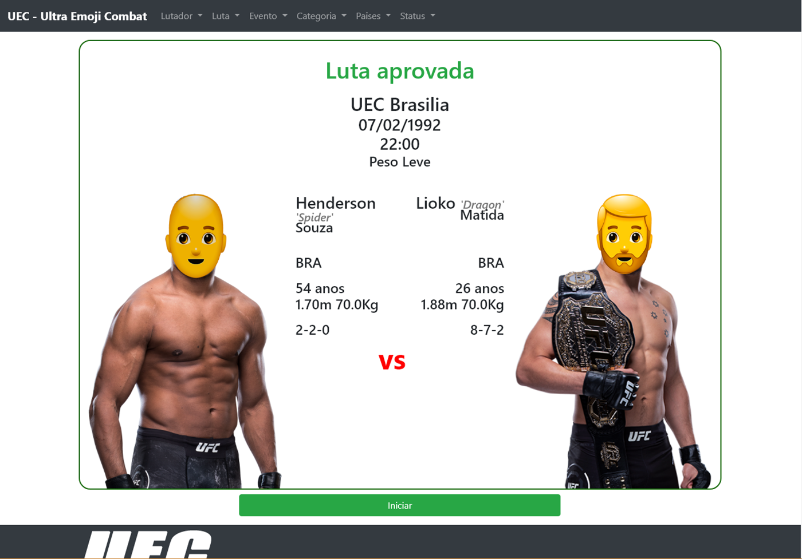
  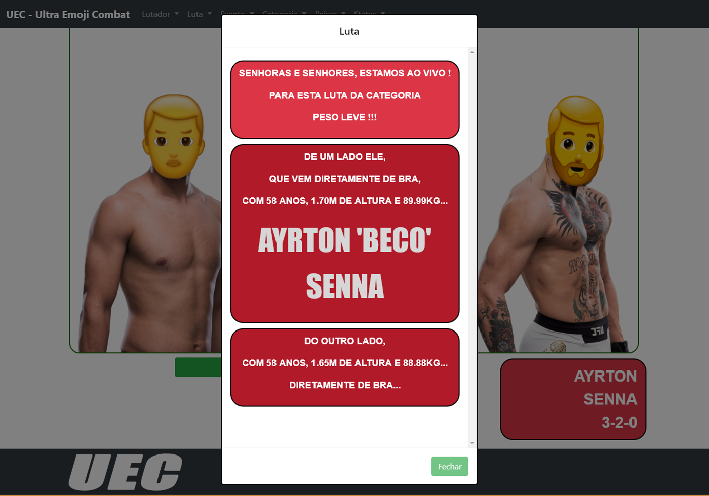
  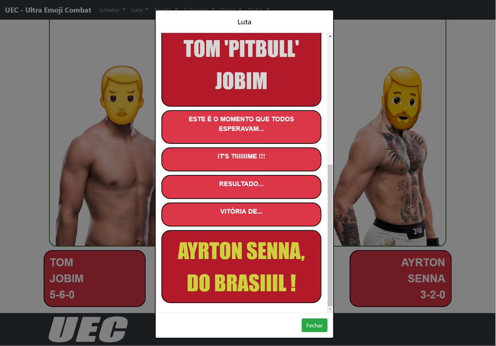
  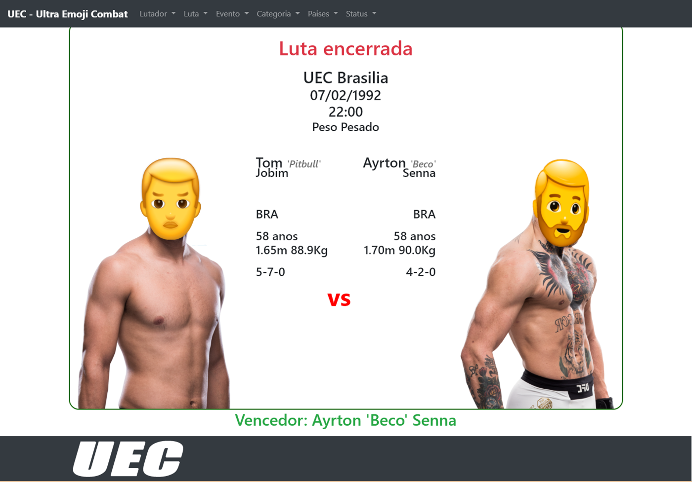

  <h3>Eventos e muitos mais</h3>
  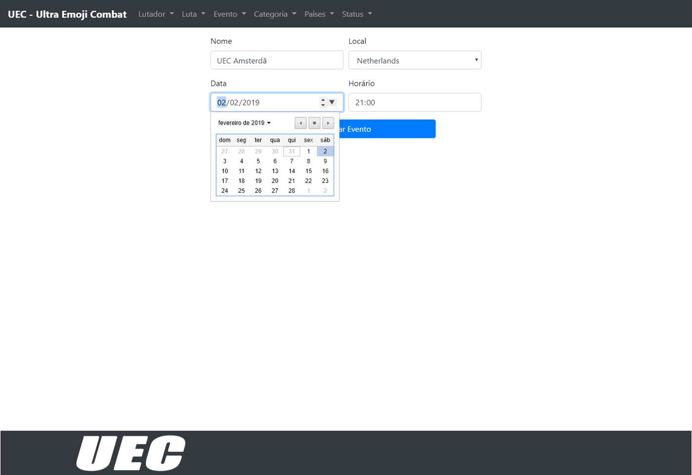
  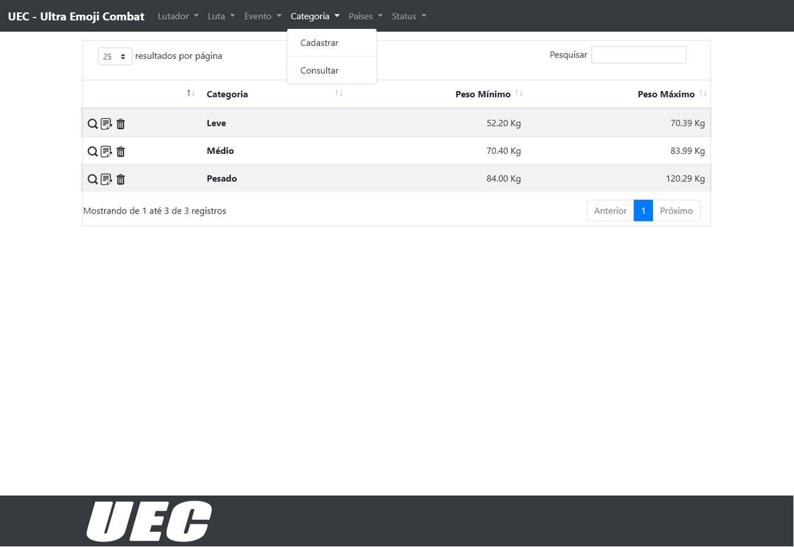
  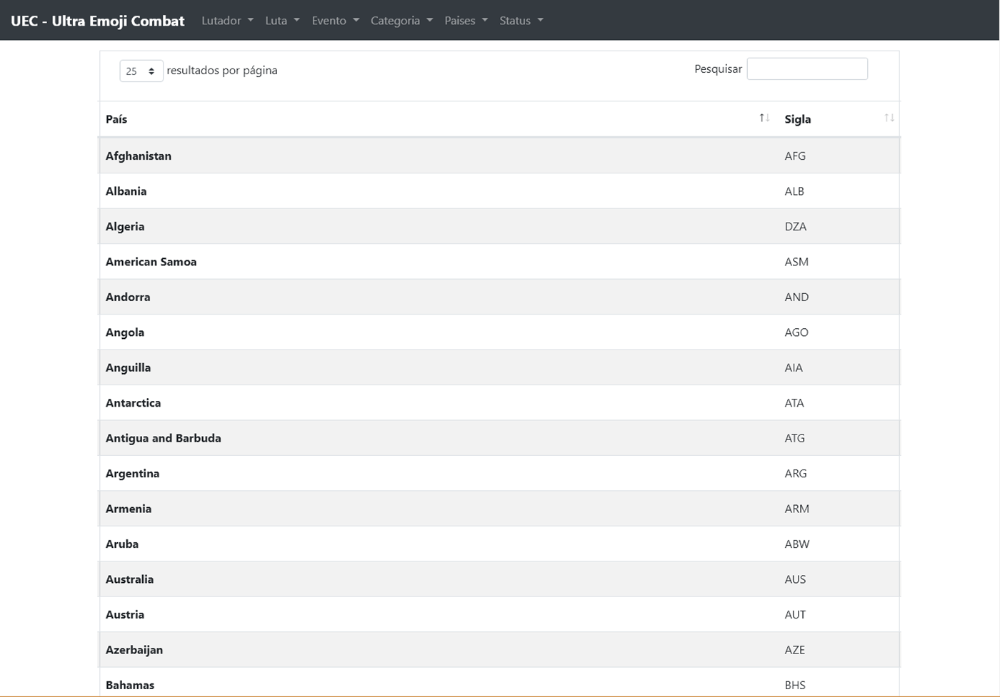
  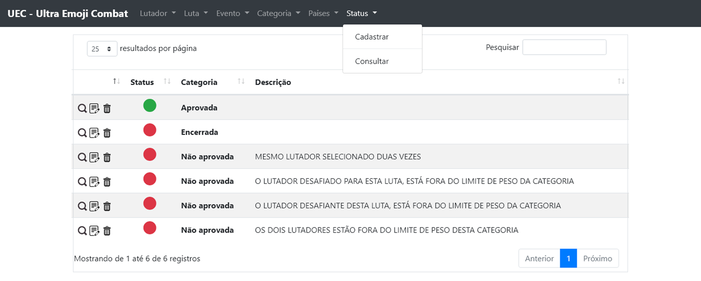

